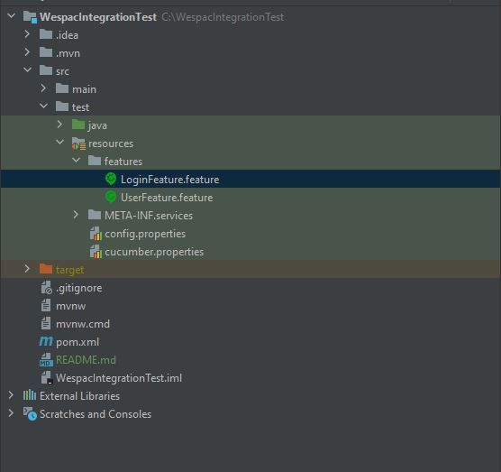

### 1. Prerequisites 
1. IntelliJ Community edition
2. JAVA SDK 8
3. GIT Bash
### 2. Importing project to IntelliJ
 1. Open Git bash 
 2. Clone repository locally by running hte following command
  
        `` git clone https://github.com/rafcasto/WespacIntegrationTest.git ``
 
 3. Open IntelliJ 
 4. Click on File > Open 
 5. Select the cloned repository 
 
> #### Note
> Once project is load to IntelliJ, it could take a couple of minutes for Intellij to download all Maven dependencies, you can go for a coffee :) 

### 3. Executing test 

1. In IntelliJ open the Project Tool window
2. Navigate to src -> test -> resources -> features 
3. right click and run feature file

> Note: Alternatively test can also be execute from windows terminal. 
> 1. In IntelliJ open the Terminal window 
> 2. execute the following command 
>> ``mvnw clean verify``  

                                                                     